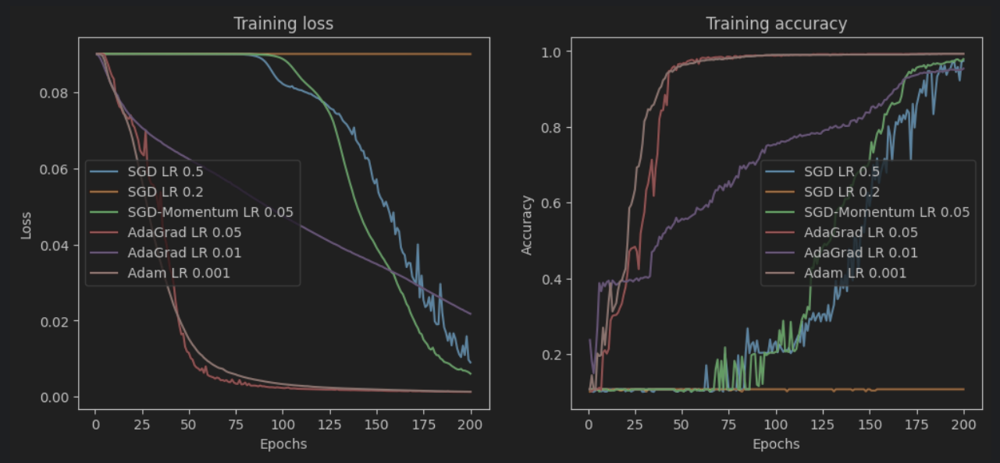

# Digit Predictor 

This project implements a simple neural network with 1794 parameters to predict the digit in a 8x8 image. It also plots the result of training
.   The network consists for 2 hidden layers and the output layer. The first hidden layer has dim(64, 20),
the second has dim(20, 20), while the output layer has dim(20, 10). 

## Numpy
[`./manual-impl.ipynb`](manual-impl.ipynb) manually implements the forwards and backwards, as well as the optimizers used 
to preforms steps for the neural network using numpy. Derivative calculations are also shown as well.

## Pytorch 
[`./pytorch-impl.ipynb`](pytorch-impl.ipynb) uses pytorch to abstract away the forwards and backwards calculations as well as the 
implmentation of the optimizers. 