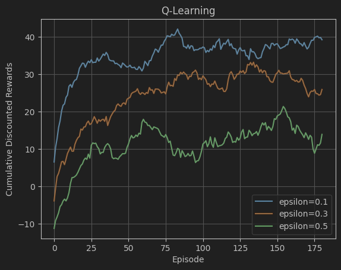

# Reinforcement Learning

## Markov Decision Process
[`MDP.ipynb`](./MDP.ipynb) implements 2 simple markov decision
processes. It determines the optimal policy using value iteration 

## Q-Learning and Model Based RL
[`RL.ipynb`](RL.ipynb) implements Q-learning and model based RL 
with value iteration. It also plots the difference different exploration 
rates makes with epsilon greedy.
 

## Deep Q-Learning
[`DQN`](DQN) trains an agent to balance a [vertical pole on a cart](https://gymnasium.farama.org/environments/classic_control/cart_pole/).
It also plots the affects of how frequently we update the target network
and batch sizes on how well it learns.
 

